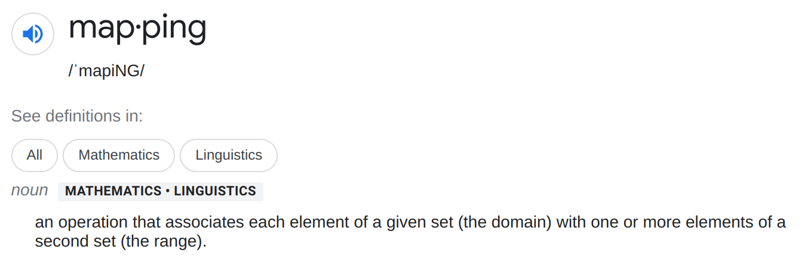

# Asynchronous behavior #2

[Slides](https://docs.google.com/presentation/d/1OZ_MElM7K_bfANSIJUcIUW9fB4T-IxU5tSwFFPkpNsI/edit?usp=sharing)

* I want to clear up some terminology.
  * Somtimes we're talking about maps as in cartography, and sometimes we're talking about mapping as in mathematics
    

* JS Execution Order & the Event Loop
  * Procedural
    ```js
    const sumOf1And1 = 1 + 1;
    const outputElem = document.getElementById('output');
    outputElem.innerHTML = `The sum of 1 and 1 is {sumOf1And1}`;
    ```
  * Conditionals
    ```js
    const sumOf1And1 = 1 + 1;
    const outputElem = document.getElementById('output');
    if (sumOf1And1 === 3) {
      outputElem.innerHTML = `
        The sum of 1 and 1 is {sumOf1And1};
        math is broken 🥴.
      `;
    } else {
      outputElem.innerHTML = `
        The sum of 1 and 1 is {sumOf1And1};
        math is fine 👍.
      `;
    }
    ```
  * Loops
    ```js
    let sumOf1And1 = 0;
    const outputElem = document.getElementById('output');
    for (let i = 0; i < 2; i++) {
      sumOf1And1 = sumOf1And1 + 1;
    }
    outputElem.innerHTML = `The sum of 1 and 1 is {sumOf1And1}.`;
    ```
  * Functions
    ```js
    function sum(a, b) {
      const result = a + b;
      return result;
    }

    const sumOf1And1 = sum(1, 1);
    const outputElem = document.getElementById('output');
    outputElem.innerHTML = `The sum of 1 and 1 is {sumOf1And1}`;
    ```
  * Events
    ```js
    let sumOf1And1;
    const calcSumBtn = document.getElementById('calc-sum');
    calcSumBtn.addEventListener('click', () => sumOf1And1 = 1 + 1);
    const outputElem = document.getElementById('output');
    outputElem.innerHTML = `The sum of 1 and 1 is {sumOf1And1}`;
    ```